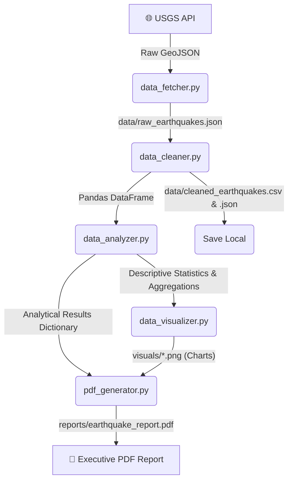

# Seismic Pipeline Engine: Context & Documentation

This project implements an interactive data engineering and analysis pipeline in Python. It follows a structured flow: **Fetch ➔ Clean ➔ Analyze ➔ Visualize ➔ Save ➔ Report** to process and report on global earthquake data.

---

## 🔹 Project Flow Architecture



The system is coordinated by [main.py](file:///c:/Users/sarth/OneDrive/Desktop/Unprof.ai/Phase/1/project/main.py), which presents a rich terminal CLI allowing you to run the entire pipeline at once or execute, inspect, and tweak individual steps.

---

## 📁 File Structure & Modules

The workspace is organized as follows:

- 🐍 [app.py](file:///c:/Users/sarth/OneDrive/Desktop/Unprof.ai/Phase/1/project/app.py): The FastAPI web server. Defines endpoint routing for pipeline executions and data asset streaming.
- 📁 [static/](file:///c:/Users/sarth/OneDrive/Desktop/Unprof.ai/Phase/1/project/static): The Single Page Application (SPA) dashboard files.
  - [index.html](file:///c:/Users/sarth/OneDrive/Desktop/Unprof.ai/Phase/1/project/static/index.html): HTML skeleton of control sidebar, cards, and tables.
  - [style.css](file:///c:/Users/sarth/OneDrive/Desktop/Unprof.ai/Phase/1/project/static/style.css): Dark glassmorphic panels and responsive styling.
  - [script.js](file:///c:/Users/sarth/OneDrive/Desktop/Unprof.ai/Phase/1/project/static/script.js): Triggers queries, runs checkpoints, updates charts, and populates rows.
- 🐍 [main.py](file:///c:/Users/sarth/OneDrive/Desktop/Unprof.ai/Phase/1/project/main.py): The terminal CLI interface and pipeline orchestrator.
- 🌐 [data_fetcher.py](file:///c:/Users/sarth/OneDrive/Desktop/Unprof.ai/Phase/1/project/data_fetcher.py): Interacts with the **USGS Earthquake Hazards Program API**.
- 🧹 [data_cleaner.py](file:///c:/Users/sarth/OneDrive/Desktop/Unprof.ai/Phase/1/project/data_cleaner.py): Clean, category-group, and flat-maps raw features using `pandas`.
- 📊 [data_analyzer.py](file:///c:/Users/sarth/OneDrive/Desktop/Unprof.ai/Phase/1/project/data_analyzer.py): Statistical aggregations, correlations, and region counters.
- 📈 [data_visualizer.py](file:///c:/Users/sarth/OneDrive/Desktop/Unprof.ai/Phase/1/project/data_visualizer.py): Generates three styled Matplotlib plots.
- 📄 [pdf_generator.py](file:///c:/Users/sarth/OneDrive/Desktop/Unprof.ai/Phase/1/project/pdf_generator.py): Compiles ReportLab layouts with dynamic page footers.
- ⚙ [requirements.txt](file:///c:/Users/sarth/OneDrive/Desktop/Unprof.ai/Phase/1/project/requirements.txt): Lists third-party dependencies required.

---

## 🚀 Getting Started

### 1. Installation
Install the project requirements into your active Python environment:
```bash
pip install -r requirements.txt
```

### 2. Running the Interactive Web Dashboard (Recommended)
Start the FastAPI server using `uvicorn`:
```bash
python -m uvicorn app:app --reload --port 8000
```
Open your web browser and go to: **[http://localhost:8000](http://localhost:8000)**

### 3. Running the Terminal CLI
Alternatively, run the interactive CLI interface:
```bash
python main.py
```

---

## 🛠 Features & Pipeline Steps

### 1. Fetch
- Queries the USGS API endpoint (`https://earthquake.usgs.gov/fdsnws/event/1/query`).
- Defaults to querying earthquakes of magnitude **2.5+** during the **last 30 days**.
- Caches the raw response to `data/raw_earthquakes.json`.

### 2. Clean
- Extracts flat columns from nested GeoJSON features, including `latitude`, `longitude`, and `depth` (from `geometry.coordinates`).
- Fills null values (e.g. fills `felt` count nulls with `0`).
- Drops duplicates based on unique earthquake event IDs.
- Parses Unix milliseconds epoch columns to Python `datetime` objects.
- Extracts clean region labels (e.g., `"CA"` or `"Japan"`) from string descriptions like `"12km E of Mammoth Lakes, CA"`.
- Assigns magnitude classifications for easier grouping.

### 3. Analyze
- Performs aggregations and calculates statistics across magnitude and depth.
- Detects the top 5 most active regions.
- Lists the top 5 largest earthquakes by magnitude.
- Performs tsunami warning percentage analyses.

### 4. Visualize
Saves three high-quality charts into the `visuals/` directory:
- `magnitude_distribution.png`: Bar chart of counts per magnitude class.
- `depth_vs_magnitude.png`: Scatter plot tracking depth profile against magnitude.
- `activity_trend.png`: A timeline tracking daily occurrence spikes alongside daily maximum recorded magnitude.

### 5. Save Local Datasets
Exports the cleaned dataset to the `data/` folder:
- CSV Format: `data/cleaned_earthquakes.csv` (ideal for spreadsheet software, SQL load, or BI tools).
- JSON Format: `data/cleaned_earthquakes.json` (ideal for web integration and web APIs).

### 6. Generate Report
- Generates a polished PDF document at `reports/earthquake_report.pdf`.
- Integrates summary tables, data insights, and the three generated charts in an executive multi-page layout.

---

## 📦 Generated Outputs

After executing option **1** in the CLI console, you will find:
1. **Raw Cache**: `data/raw_earthquakes.json`
2. **Cleaned Datasets**: `data/cleaned_earthquakes.csv` and `data/cleaned_earthquakes.json`
3. **Visuals**: `visuals/magnitude_distribution.png`, `visuals/depth_vs_magnitude.png`, `visuals/activity_trend.png`
4. **PDF Report**: `reports/earthquake_report.pdf`
